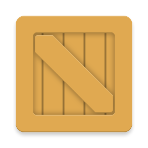

[](https://jitpack.io/#com.github.oriley-me/crate) [](http://www.apache.org/licenses/LICENSE-2.0) [](https://travis-ci.org/oriley-me/crate) [](https://www.versioneye.com/user/projects/56e39ab7df573d00472cd399)

# Crate


Crate is a simple gradle plugin to generate a list of classes for all files/folders included in your projects
assets directory, for compile time safety. This is how the `R` classes used for referencing resources work. It also has
the advantage of removing the need to use the notoriously slow `AssetManager.list()` methods.

Included is a built-in caching mechanism for `Typeface`s, `Bitmap`s and `PictureDrawable`s to speed up subsequent access.

No more string literals or typos, all your assets can be accessed with confidence!

Each `Asset` has the following methods:
`getPath()`: Will return the full path as required by an `AssetManager`
`getName()`: Returns just the file name of the asset
`isGzipped()`: Returns whether the file is Gzip compressed (will be automatically handled by `Crate`)
`asUri()`: Returns the file path formatted as a Uri string for consumption by external libraries

There are four subtypes of `Asset`, which contain extra information about the asset (calculated at compile time).
They are:

* FontAsset

Content Types: "application/x-font-otf", "application/x-font-ttf"

Methods:
`getFontName()`: Returns the human readable name embedded in the font.

* ImageAsset

Content Types: "image/jpeg", "image/png", "image/pjpeg", "image/gif", "image/bmp", "image/x-windows-bmp", "image/webp"

Methods:
`getWidth()`: Returns the width of the image, as calculated at compile time.
`getHeight()`: Returns the height of the image, as calculated at compile time.

* SvgAsset

Content Types: "image/svg+xml", "image/svg+xml-compressed"

No extra methods. Requires adding the `androidsvg` library as a depenency in your module (refer to Gradle setup
explanation below).
* TODO: Read in some helpful SVG properties at compile time.

* VideoAsset

Content Types: "video/3gpp", "video/mp4", "video/webm"

`getWidth()`: Returns the width of the video, as calculated at compile time by `MediaInfo`.
`getHeight()`: Returns the height of the video, as calculated at compile time by `MediaInfo`.

* NOTE: I have noticed `MediaInfo` can be a bit hit and miss, so if you have any issues (most likely all width and
height values being invalid), feel free to let me know some details (operating system, IDE, Gradle/Java version etc)
so I can look into it.

## Usage

To construct the `Crate`, you will need to use the `Crate.Builder` class. Included are methods for setting the max size
of each cache (in number of objects cached). The default is 0, so you must call the builder methods and pass a positive
value to have any caching take place.

Note: I would not recommend using the `Bitmap` cache unless you know you have a small quantity of medium to low
resolution images. For better caching performance of large assets, I'd advise looking into `Picasso` or `Glide` and
passing the asset path to those, as they are purposely built for it and have fantastic caching mechanisms.

Example construction:
```java
// In constructor/application
mCrate = new Crate.Builder(this)
                .bitmapCacheMaxSize(20)
                .typefaceCacheMaxSize(200)
                .svgCacheMaxSize(2000)
                .build();
```

After construction, you can access all your assets easily:
```java
// Usage for InputStream
try {
    Asset asset = mCrate.assets.other.RANDOM_FILE_EXT; // To open assets/other/random_file.ext
    InputStream is = mCrate.open(asset);
    // Do what you will with the input stream
} catch (IOException e) {
    // Handle exception
}

// Usage for Typeface (FontAsset)
FontAsset fontAsset = mCrate.assets.fonts.ROBOTO_SLAB_TTF; // To get assets/fonts/Roboto-Slab.ttf
Typeface typeface = mCrate.getTypeface(fontAsset);

// Usage for Bitmap (ImageAsset)
ImageAsset imageAsset = mCrate.assets.images.LARGE_BACKGROUND_JPG; // To open assets/images/large_background.jpg
Bitmap bitmap = mCrate.getBitmap(imageAsset);

// Usage for PictureDrawable (SvgAsset)
SvgAsset svgAsset = mCrate.assets.svgs.LOVE_VECTORS_SVG; // To open assets/svgs/love_vectors.svg
PictureDrawable drawable = mCrate.getSvgDrawable(svgAsset);

// When no longer required
mCrate.clear();
mCrate = null;
```

If you don't want to use the helper methods in `Crate` to work with assets and would rather just take advantage of the
compile time safety of the `CrateDictionary`, you can add the following static field to your `Application` class:

```java
public static final CrateDictionary.AssetsClass assets = new CrateDictionary().assets;
```
This will allow you to retrieve assets statically and use them with an `AssetManager`, like so:
```java
try {
    Asset asset = MyApplication.assets.other.RANDOM_FILE;
    InputStream is = mAssetManager.open(asset.getPath());
    // Do what you will with the input stream
} catch (IOException e) {
    // Handle exception
}
```
Keep in mind that this will keep all `Asset` reference entries permanently in memory, so if possible use the `Crate`
instance method and don't forget to `clear()` and `null` it when you're done ;-)

You can also retrieve a list of all `Asset`s in a directory via:
```java
for (Asset asset : mCrate.assets.other.LIST) {
    // Perform action
}
```
Or, for all `Asset`s in your project:
```java
for (Asset asset : mCrate.assets.FULL_LIST) {
    // Perform action
}
```

The `LIST` field for each folder will be of type `List<? extends Asset>`. If all files in a folder are of the same asset
subtype (`FontAsset`, `ImageAsset` or `SvgAsset`), this concrete type will be used to remove the need for checking and casting.
In all other cases, the root `Asset` type will be used.

#### Cleanup

`Crate` will not automatically clear any caches, so if you are finished with using them you should call the following
methods to ensure `Typeface`s can be freed up, or `Bitmap`s are recycled.

```java
// To clear typeface cache
mCrate.clearTypefaceCache();

// To recycle all Bitmaps and clear the cache
mCrate.clearBitmapCache();

// To clear SVG cache
mCrate.clearSvgCache();

// To clear all caches
mCrate.clear();
```

You can also pass in specific assets to clear the caches for, as follows:
```java
// Clear a few specific assets
mCrate.clearTypefaceCache(robotoBoldAsset, robotoSlabAsset);
mCrate.clearBitmapCache(largeBackgroundAsset);
mCrate.clearSvgCache(emoji1, emoji2, emoji3);
```

## Gradle Dependency

 * Add JitPack.io to your repositories list in the root projects build.gradle:

```gradle
repositories {
    maven { url "https://jitpack.io" }
}
```

 * Add crate-plugin to your buildscript classpath:

```gradle
buildscript {
    dependencies {
        classpath 'me.oriley.crate:crate-plugin:0.4.1'
    }
}
```

If you would like to run a newer version you can change the version number to `-SNAPSHOT` for the latest master
branch, or a specific commit hash if you need an exact version. That's the beauty of JitPack. Just beware that API's
can be subject to change without notice if you don't stick to a release version.

 * Apply the plugin to your application or library project, and add the module runtime dependency:

```gradle
apply plugin: 'com.android.application' || apply plugin: 'com.android.library'
apply plugin: 'me.oriley.crate-plugin'

...

dependencies {
    compile 'me.oriley.crate:crate-runtime:0.4.1'

    // Optional, only required if you plan to use the helper SVG parsing and caching methods
    compile 'com.caverock:androidsvg:1.2.1'
}
```

Crate also includes a Gradle DSL extension to enable extra logging, should you have any issues:
```groovy
crate {
    // Default is false, will output more info to gradle log and Android logcat if set to true
    debugLogging = true
}
```

Now just perform a gradle sync and you're done. You can now have compile time safety with all your projects assets.

## Example

As an example of how efficient and useful `Crate` can be, here's all the code you will need to display an entire folder
of fonts in a `RecyclerView`, with full `Typeface` caching and font display names automatically retrieved and set.

```java
class FontViewHolder extends RecyclerView.ViewHolder {

    TextView textView;

    FontViewHolder(View view) {
        super(view);
        textView = (TextView) view.findViewById(R.id.text_view);
    }
}

class FontRecyclerAdapter extends RecyclerView.Adapter<FontViewHolder> {

    private final Crate mCrate;

    FontRecyclerAdapter(Context context) {
        mCrate = new Crate(context);
    }

    @Override
    public FontViewHolder onCreateViewHolder(ViewGroup viewGroup, int position) {
        View view = LayoutInflater.from(viewGroup.getContext())
                .inflate(R.layout.font_view_item, viewGroup, false);
        return new FontViewHolder(view);
    }

    @Override
    public void onBindViewHolder(FontViewHolder holder, int position) {
        FontAsset fontAsset = mCrate.assets.fonts.LIST.get(position);
        holder.textView.setText(fontAsset.getFontName());
        holder.textView.setTypeface(mCrate.getTypeface(fontAsset));
    }

    @Override
    public int getItemCount() {
        return mCrate.assets.fonts.LIST.size();
    }
}

```

Just add that to any `Activity` hosting a `RecyclerView`, create and set the `FontRecyclerAdapter` and voilà:


